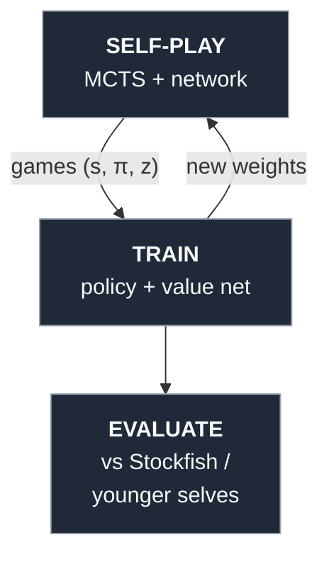

# AlphaZero-lite

**Author:** Arjun Joshi  ·  **Updated:** June 18, 2026

<table>
<tr>
<td>
<pre>
⠀⠀⠀⠀⠀⠀⠀⢀⣀⡤⠴⠶⠶⠒⠲⠦⢤⣀⠀⠀⠀⠀⠀⠀⠀⠀⠀⠀
⠀⠀⠀⠀⢀⡠⠞⠋⠀⠀⠀⠀⠀⠀⠀⠀⠀⠈⠉⠲⠤⣄⡀⠀⠀⠀⠀⠀
⠀⠀⣀⡴⠋⠀⠀⠀⠀⠀⠀⠀⠀⠀⠀⠀⠀⠀⠀⠀⠀⣤⡿⠀⠀⠀⠀⠀
⠀⢾⣅⡀⠀⠀⠀⠀⣀⠀⠀⠀⠀⠀⠀⢀⡦⠤⠄⠀⠀⢻⡀⠀⠀⠀⠀⠀
⠀⠈⢹⡏⠀⠀⠐⠋⠉⠁⠀⠻⢿⠟⠁⠀⠀⢤⠀⠀⠠⠤⢷⣤⣤⢤⡄⠀
⠀⠀⣼⡤⠤⠀⠀⠘⣆⡀⠀⣀⡼⠦⣄⣀⡤⠊⠀⠀⠀⠤⣼⠟⠀⠀⢹⡂
⠀⠊⣿⡠⠆⠀⠀⠀⠈⠉⠉⠙⠤⠤⠋⠀⠀⠀⠀⠀⠀⡰⠋⠀⠀⠀⡼⠁
⠀⢀⡾⣧⡀⠀⠀⠀⠀⠀⠀⠀⠀⠀⠀⠀⠀⠀⠀⠀⠜⠁⠀⠀⠀⣸⠁⠀
⠀⠀⠀⡼⠙⠢⠀⠀⠀⠀⢀⣀⡤⠴⠶⠶⠒⠲⠦⢤⣀⠀⠀⠀⣰⠃⠀⠀
⠀⢀⡞⠁⠀⠀⠀⠀⣰⠃⢀⣀ ⠠ ⢀⣀ ⡀⢀⠀⢹⡂⠀⠀⣰⠃⠀⠀⠀
⠀⡼⠀⠀⠀⠀⣰⠃⣰⠃⠣⠼ ⡸ ⠣⠼ ⠜⠣⠀⠀⡇⠀⠀⡇⠀⠀⠀⠀
⣾⠁⠀⢀⣠⡴⠆⣰ ⣀⣀  ⢀⣀ ⠄ ⢀⡀ ⡀⣀⢹⠀⢹⡂  ⠀⠀⠀⠀
⠈⠛⠻⠉⠀⠀⢀⡞ ⠇⠇⠇ ⠣⠼ ⠇ ⠣⠜ ⠏  ⢹ ⡇
        ⠘⣆⠈⠛⠻⠉⠛⠻⠉⠛⠻⠉⠛⠻⠉ ⡼ ⣰
</pre>
</td>
<td>
<p>A small, readable <strong>AlphaZero-style chess engine</strong>, built from scratch to <em>learn the reinforcement-learning fundamentals</em> — not to be a world-class engine. No human games, no hand-written evaluation: the network starts random and improves purely by playing itself. The whole point is to understand <strong>every line</strong> of how it gets stronger.</p>
</td>
</tr>
</table>

## The idea in one picture



The search (MCTS) is the **expert**; the network **distills** what the search found;
the better network makes the next search stronger. That loop — *expert iteration* — is
the engine. There is no human data and no hand-written evaluation anywhere in it.

## What this actually is

In one line: **PUCT-guided tree search + an expert-iteration self-play loop** — the
AlphaZero recipe, scaled down to a single GPU.

- **Not classic MCTS.** There are no random rollouts. A leaf is evaluated by the
  network's *value head*, not by playing the game out randomly — the "Monte Carlo"
  part is replaced by a learned evaluation. That's the key AlphaZero distinction.
- **One network, two heads.** A single residual CNN outputs both a **policy** (a prior
  over moves) and a **value** (who's winning). Trained jointly.
- **From scratch.** Self-play from a random net, zero human games — AlphaZero, not the
  earlier AlphaGo lineage.

## The four pieces (read them in this order)

| File | What it teaches |
|------|-----------------|
| `src/encoding.py` | Turning a chess position into a tensor, and moves into a fixed action space (the AlphaZero **8×8×73 = 4672** move encoding, 17 input planes). |
| `src/network.py`  | A small residual CNN with two heads: **policy** (move probabilities) and **value** (who's winning). |
| `src/mcts.py`     | Network-guided tree search via **PUCT**. This is where "planning" happens — and where the batched `BatchedMCTS` runs many games in lockstep for the GPU. |
| `src/selfplay.py` + `src/train.py` | The RL loop: generate games, store `(state, search-policy π, game-outcome z)`, fit the net, repeat. |

For the theory worked out longhand, see [`docs/fundamentals.md`](docs/fundamentals.md)
(GPI / expert iteration, the loss) and [`docs/puct.md`](docs/puct.md) (UCB1 → UCT →
PUCT, derived from scratch).

## Project layout

```
.
├── src/                  # the engine
│   ├── encoding.py       # board ↔ tensor, move ↔ index (4672 action space)
│   ├── network.py        # ChessNet: residual tower + policy & value heads
│   ├── mcts.py           # PUCT search; BatchedMCTS for GPU-batched self-play
│   ├── selfplay.py       # play_game / generate_games (+ parallel)
│   ├── distributed_selfplay.py  # multiprocess actor pool (CPU-bound search)
│   ├── train.py          # the loop: YAML config + CLI overrides
│   ├── config.py         # dataclass config, YAML load/save
│   ├── metrics.py        # progress.log + metrics.csv/jsonl + TensorBoard
│   ├── evaluate.py       # net_move / play_match helpers
│   └── play.py           # play the current net yourself
├── configs/              # run configs (default.yaml, run_1.yaml, ...)
├── docs/                 # fundamentals.md, puct.md — the theory, longhand
├── runs/                 # per-run checkpoints, logs, TensorBoard
└── user/                 # analysis & eval tooling (see below)
```

## Setup

Use a conda/mamba env (default), or a plain venv — either is fine.

```bash
# Default: conda / mamba
mamba create -n az-lite python=3.12
mamba activate az-lite
pip install -r requirements.txt

# Or a venv
python -m venv .venv && source .venv/bin/activate
pip install -r requirements.txt

# Stockfish (evaluation only):  apt install stockfish   (or grab a binary)
```

## Run

```bash
# 0. sanity-check: the encoding round-trips every legal move
python -m src.encoding --selftest

# 1. one iteration of the loop (self-play -> train -> save)
python -m src.train --iterations 1 --games 20 --sims 100

# 2. a real run from a config, with CLI overrides
python -m src.train --config configs/default.yaml --name run_0
python -m src.train --config configs/run_1.yaml          # c_puct=2, deeper net, etc.

# 3. watch the net play, or play it yourself
#    (point --checkpoint at a real file — runs land under runs/<name>/checkpoints/)
python -m src.evaluate --checkpoint runs/run_0/checkpoints/net_iter500.pt \
                       --vs stockfish --level 1 --games 10
python -m src.play --checkpoint runs/run_0/checkpoints/net_iter500.pt --as white
```

`train.py` flags (all optional; override the YAML): `--name --iterations --games
--sims --parallel --workers --precision {bf16,fp16,fp32} --resume <ckpt>`.
`evaluate.py`: `--checkpoint --vs {stockfish,random} --level 0-20 --engine <path>
--games --sims`. `play.py`: `--checkpoint --as {white,black} --sims`.

## Evaluating strength (the part that actually matters)

**Loss is not strength.** The training loss plateaus early and then barely moves while
the engine keeps getting *stronger* — so the only honest measure is making nets play
games. The `user/` tools do exactly that:

| Tool | What it answers |
|------|-----------------|
| `user/head2head.py` | One checkpoint vs another under identical search (handles different net depths). |
| `user/strength_curve.py` | Relative **Elo over training** — each checkpoint vs the previous one (the cheap "ladder" AlphaZero used). |
| `user/eval_stockfish.py` | External bar: latest net vs **Stockfish** across a skill ladder. |
| `user/eval_progress.py` | Combined report (vs Stockfish *and* vs younger selves), with CSV export to `eval/`. |

> ⚠️ **Determinism gotcha (learned the hard way):** greedy eval (no Dirichlet noise,
> temperature 0) makes every game from the start position *identical* — so "50 games"
> can secretly be 2 games replayed. The eval tools seed each game from a **random
> opening** so the N games are genuinely distinct. Watch your confidence intervals:
> win-rate standard error is `√(0.25/n)`, so 8 games is ±18% — basically noise.

## What to expect

On a single GPU, a few hours of self-play with a small net produces a clear,
measurable strength curve (visible in the ladder Elo) even while the loss is flat.
It's a *small* net at low simulation counts, so don't expect to dethrone Stockfish —
expect to **understand every line of how it got there**, and to have the tooling to
prove what it can and can't do.

Reference runs in `runs/`: `run_0` (baseline, 500 iterations / ~48k self-play games)
and `run_1` (an experiment: higher `c_puct`, more exploratory moves, one extra
residual block).

## Hardware notes

Developed on an **RTX 4070 Ti (12 GB)**. Self-play is **CPU-bound** — the tree search,
not the tiny network forward pass, is the bottleneck — so throughput comes from
batching many games per network call (`BatchedMCTS`) and running multiple self-play
worker processes. Training uses **bf16** autocast on the Ada tensor cores.

## Credits

Built as a hands-on RL learning exercise. 

AlphaZero: Silver et al., 2018. Expert Iteration: Anthony et al., 2017. Board rules & UCI 
[python-chess](https://python-chess.readthedocs.io/); 

Stockfish for the external benchmark.

<!-- Author / license — fill in your own:
Author: Arjun Joshi
License: MIT (or whatever you choose)
-->
